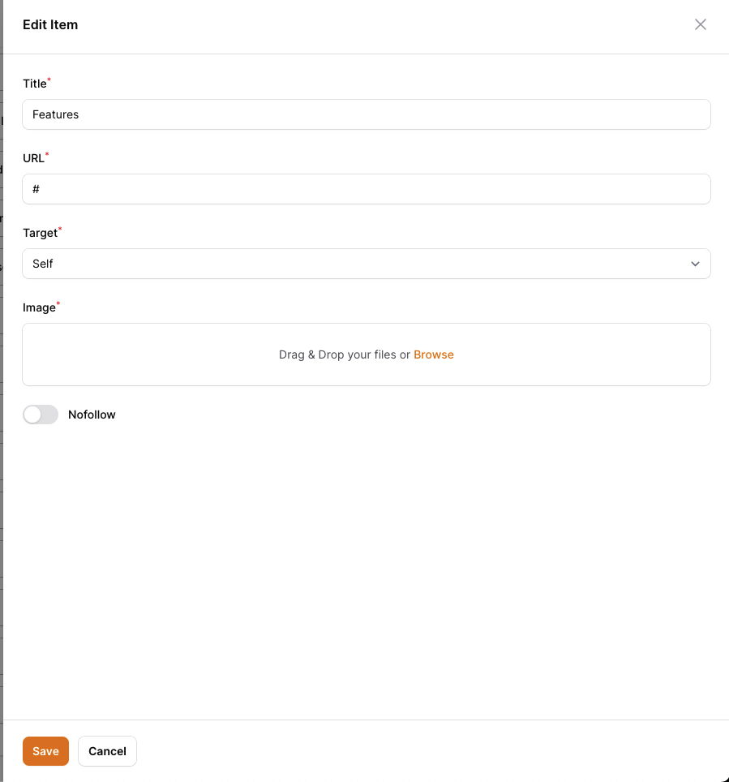

# Filament Menu Manager


## Introduction

The Menu Manager package is a paid package developed for Filament, helping you manage the menu space for your site as you wish. With the features this plugin offers, you can create a menu space in any location, add menu groups as you like, display your existing data in the menu, and you can do this either by drag and drop or using navigation buttons.

Managing menus might be challenging, but with this plugin, you will be able to do it in a user-friendly manner, making your work easier. This package is fully customizable for your convenience.

### Features

- Manage your menus using multiple locations
- Change the order of menu items using drag and drop
- Reordering menu items using buttons
- Set the maximum depth of menu items based on location
- Create custom links to add to the menu
- Add your fixed links to the menu item
- Add existing data to the menu and present their URLs as items
- Create a custom menu panel
- Translate texts
- Add location-based form components
- Add panel-based form components
- Modify default form components
- Authorization of menu actions
- Instantly save changes made to the menu with auto-save mode
- Reflect your menus on the front end using the special directive created for Blade
- Change the default menu model and use your own model
- Customize the Menu Manager page

### Screenshots

#### Menu Manager Page (Light and Dark Theme)

The menu manager page lists menu items based on location. The menu panels you add are also displayed here.


#### Location Selector

You can add any locations you like and create items. Changing the default location is possible.


#### Custom Link Panel

You can add any `link` you want as an item using this panel.


#### Fixed Link Panel

Using this panel, you can add the `fixed links` you specify as items.


#### Model Panel

Using this panel, you can show the models you set to use menu items as a panel. The example below shows the `Product` model as the menu is set to be available.


#### Quick Edit


#### Drag and Drop


#### Reordering with Buttons


## Installation

Thank you for purchasing Menu Manager!

Below you will see the installation steps on how to install the menu manager. Of course, if you have any questions, find a bug, need support, or have a feature request, please don't hesitate to reach out to me at [Discord](https://discord.gg/filament) or filamentmenumanager@gmail.com

### Requirements

- PHP: 8.1+
- MySQL: 5.7.24+ or Postgres
- Filament: 3.0+
- Laravel: 10.0+

### Installing with Composer

To install Menu Manager you'll need to add the package to your `composer.json` file:

```bash
{
    "repositories": [
        {
            "type": "composer",
            "url": "https://filament-menu-manager.composer.sh"
        }
    ],
}
```

Once the repository has been added to your composer.json file, you can install Menu Manager like any other composer package using the composer require command:

```bash
composer require ysfkaya/filament-menu-manager
```

Next, you will be prompted to provide your username and password.

```bash
Loading composer repositories with package information
Authentication required (filament-menu-manager.composer.sh):
Username: [licensee-email]
Password: [license-key]
```

Your username will be your email address and the password will is your license key, followed by a colon (:), followed by the domain you are activating. For example, let's say we have the following email and license activation:

- Contact email: **email@gmail.com**
- License key: **8b8da5f8-a2a1-11ee-8f4b-0242ac120002**
- Activation fingerprint: **fingerprint**

You will need to enter the above information as follows when prompted for your credentials:

```bash
Loading composer repositories with package information
Authentication required (filament-menu-manager.composer.sh):
Username: my_email@gmail.com
Password: 8b8da5f8-a2a1-11ee-8f4b-0242ac120002:my_domain.com
```

The license key and fingerprint should be separated by a colon (:).

> Tip: If you get a `402 error`, most likely you forgot to add the colon and fingerprint.

### Setting up Menu Manager in Filament Panels

1. Publish and run the migrations

   ```bash
   php artisan vendor:publish --tag="fi-menu-manager-migrations"
   php artisan migrate
   ```

2. Publish the language files

   Optionally, you may publish the language files:

   ```bash
   php artisan vendor:publish --tag="fi-menu-manager-translations"
   ```

3. Add Menu Manager to your Filament Panel

   Add Menu Manager to a panel by instantiating the plugin class and passing it to the `plugins()` method of the configuration:

   ```php
   use Ysfkaya\Menu\MenuPlugin;

   public function panel(Panel $panel): Panel
   {
       return $panel
           ->default()
           ->plugins([
               MenuPlugin::make()
           ])
   }
   ```

4. Publish Config (Optional)

   If you want to change the default settings of the plugin, you can publish the config file.

   ```bash
   php artisan vendor:publish --tag="filament-menu-manager-config"
   ```

5. Publish Assets

   After adding the plugin to your default panel, you need to publish the assets to see the style files used by the plugin.

   ```bash
   php artisan filament:assets
   ```

## How it Works

The Menu Manager's database is based on nested sets and uses the [Nested Set](https://github.com/lazychaser/laravel-nestedset) library for Laravel.

The purpose of the library is as stated in the documentation:

> Nested sets or Nested Set Model is a way to effectively store hierarchical data in a relational table.

For more information, see the related library [documentation](https://github.com/lazychaser/laravel-nestedset#what-are-nested-sets).

In this plugin, the Menu Manager page, which is prepared using form components specially prepared for Filament, provides data update operations and saves them to the database. The menu tree is listed according to the location you select. Suppose you have performed relocation operations on the `header` location and even if you switch to the `footer` location without saving these changes, the changes you made in the `header` location will not be lost.

Menu panels are custom groups of menu items that you specify on the plugin page. With these panels you can add new items to your menu tree. The custom `listener` registered in `MenuCard` runs the special event that is dispatched on the panel and processes it in `MenuCard`.

During the saving process, it saves the data to the database in nested data logic by using the feature of the related library.

## Setting up the plugin

Once installed, you will see a new page called "Menu Manager" in your sidebar. On this page your users can change the location of the menu, add menu item, reorder, edit the added item via menu panels.

### Adding Locations

Locations refer to the areas in the front-end unit. You can use the locations to position each menu tree in different places.

```php
use Ysfkaya\Menu\MenuPlugin;

public function panel(Panel $panel): Panel
{
    return $panel
        ->plugins([
            MenuPlugin::make()
                ->addLocation(name: 'header', label: 'Header', depth: 3)
                ->addLocation(name: 'footer', label: 'Footer', depth: 2)
                ->addLocation(name: 'header_mobile', label: 'Header Mobile', depth: 3),
        ])
}
```

When you set locations as in the example above, you will see `Header` and `Footer` titles in the location selector options on the Menu Manager page.

Since `header` location is set by default, when you first visit the plugin page, it will be set as selected and you will see the menu tree for the `header` location.

> Note: If the default location is not set, the first location you add will be used by default.


#### Configure Location Depth

The Depth parameter determines the maximum depth of the menu tree for the location you added.

If we take the example below, let's say your header menu will have menu items with a maximum depth of 3. Then the menu items you can add in the menu manager will be limited in this direction.

```php
use Ysfkaya\Menu\MenuPlugin;

public function panel(Panel $panel): Panel
{
    return $panel
        ->plugins([
            MenuPlugin::make()
                ->addLocation(name: 'header', label: 'Header', depth: 3)
        ])
}
```

The maximum depth will be as follows.

```md
header
├── Features
├── Products
│ ├── Analytics
│ ├── Engagement
│ └── Security
├── Marketplace
├── Company
│ ├── About Us
│ ├── Services
│ │ ├── Service 1
│ │ ├── Service 2
│ │ │ ├── Sub Service ---> This will not be displayed. Because its current level is 4.
└── Contact
```

### Setting up Menu Panels

Menu panels are used to add new items to your menu tree. You can do it quickly using the `CustomMenuPanel`, `ModelMenuPanel` and `StaticMenuPanel` panels built into this plugin.

In this topic, you will learn how to change the default menu panels and how to create custom menu panels that you can create according to your needs.

#### CustomMenuPanel

This menu panel is a panel that you can use to add custom items to the menu tree. `It used by default.`

```php
use Ysfkaya\Menu\MenuPlugin;
use Ysfkaya\Menu\Panels\CustomMenuPanel;

public function panel(Panel $panel): Panel
{
    return $panel
        ->plugins([
            MenuPlugin::make()
                ->addMenuPanel(fn() => CustomMenuPanel::make()),
        ])
}
```


#### ModelMenuPanel

This menu panel is available for eloquent models. Once you have set up your model accordingly, you will be able to see your model in the menu panels section and you will be able to add related items to the panel using selectbox.

```php
use Ysfkaya\Menu\MenuPlugin;
use Ysfkaya\Menu\Panels\ModelMenuPanel;

public function panel(Panel $panel): Panel
{
    return $panel
        ->plugins([
            MenuPlugin::make()
                ->addMenuPanel(fn() => ModelMenuPanel::make()),
        ])
}
```

After setting up the plugin, you need to add the `HasMenu` interfaces and the `InteractsWithMenu` trait to your model, as shown in the example below.

A `Product` model:

```php
namespace App\Models\Shop;

// ...
use Ysfkaya\Menu\Concerns\InteractsWithMenu;
use Ysfkaya\Menu\Contracts\HasMenu;

class Product extends Model implements HasMenu
{
    use InteractsWithMenu;

    // ...

    public function getMenuLabel(): string;

    public function getMenuPanelSort(): int;

    public function getMenuSingularLabel(): string;

    public function getMenuTitleColumn(): string;

    public function getMenuUrlResolver(): callable;

    public function getMenuModifyQueryCallback(): ?callable;
}
```

A `Post` model:

```php
namespace App\Models\Blog;

// ...
use Ysfkaya\Menu\Concerns\InteractsWithMenu;
use Ysfkaya\Menu\Contracts\HasMenu;

class Post extends Model implements HasMenu
{
    use InteractsWithMenu;

    // ...

    public function getMenuPanelSort(): int
    {
        return 2;
    }

    public function getMenuUrlResolver(): callable
    {
        return function (Post $model) {
            return route('post', ['slug' => $model->slug]);
        };
    }

    public function getMenuTitleColumn(): string
    {
        return 'title';
    }
}
```


The `ModelMenuPanel` class automatically discovers all your models with the `App\Models` namespace in the `app/Models` path. If you want to add a 3rd party model to this panel, you can directly call the `addModel` function. You can also use the `discoverModelsIn` method to automatically save your models if they are in a different location.

> Please note that the 3rd party model you will use must also have the `HasMenu` interface.

```php
use Ysfkaya\Menu\MenuPlugin;
use Ysfkaya\Menu\Panels\ModelMenuPanel;

public function panel(Panel $panel): Panel
{
    return $panel
        ->plugins([
            MenuPlugin::make()
                ->addMenuPanel(
                    fn() => ModelMenuPanel::make()
                            ->addModel(ModelName::class)
                            ->discoverModelsIn(
                                path: app_path('Domain/Models'),
                                namespace: 'App\\Domain\\Models'
                            )
                ),
        ])
}
```

#### StaticMenuPanel

If you have fixed url addresses on your site and want to show them in the menu panel, `StaticMenuPanel` will meet your needs.

```php
use Ysfkaya\Menu\MenuPlugin;
use Ysfkaya\Menu\Panels\StaticMenuPanel;

public function panel(Panel $panel): Panel
{
    return $panel
        ->plugins([
            MenuPlugin::make()
                ->addMenuPanel(fn() =>
                    StaticMenuPanel::make()
                        ->addLink('Home', '/')
                        ->addLink('About', '/about')
                        ->addLink('Contact', '/contact')
                        // You can also add links with a single method
                        ->links([
                            [
                                'title' => 'Careers',
                                'url' => '/careers'
                            ],
                            [
                                'title' => 'Blog',
                                'url' => '/blog'
                            ],
                        ])
                ),
        ])
}
```


#### Creating Your Own Menu Panel

Apart from the menu panels built into this plugin, you can create your own custom menu panels for your needs.

First, create a new menu panel class.

```php
<?php

namespace App\Menu\Panels;

use App\Models\Blog\Category;
use Filament\Forms\Components\CheckboxList;
use Ysfkaya\Menu\Panels\MenuPanel;

class CategoriesMenuPanel extends MenuPanel
{
    protected ?string $name = 'category';

    protected function setUp(): void
    {
        parent::setUp();

        $this->label('Post Categories');
    }

    public function getSchema(): array
    {
        return [
            CheckboxList::make('categories')
                ->required()
                ->hiddenLabel()
                ->bulkToggleable()
                ->options(fn () => Category::pluck('name', 'id')),
        ];
    }

    /**
     * This method will be called when the panel item is added to the menu.
     *
     * IMPORTANT: Each value must be an array of items.
     *
     * @Example:
     *  [
     *    [
     *      'title' => 'Category 1',
     *      'url' => 'http://example.com/category-1',
     *      'target' => '_blank',
     *      'rel' => 'nofollow' // This value stored in the `data` column of the menu table.
     *    ]
     *  ]
     *
     * @param  array  $state  The state of the panel from components.
     *
     * @return array|null
     */
    public function added($state)
    {
        $categories = $state['categories'] ?? [];

        if (blank($categories)) {
            return [];
        }

        return Category::find($categories)->map(fn ($category) => [
            'title' => $category->name,
            'url' => url("/blog/categories/{$category->slug}")
        ])->toArray();
    }
}
```

After making the necessary adjustments, you need to add the plugin to your newly created menu panel.

```php
use Ysfkaya\Menu\MenuPlugin;
use App\Menu\Panels\CategoriesMenuPanel;

public function panel(Panel $panel): Panel
{
    return $panel
        ->default()
        ->plugins([
            MenuPlugin::make()
                ->addLocation(name: 'header', label: 'Header', depth: 3)
                ->addMenuPanel(fn() => CategoriesMenuPanel::make())
        ])
}
```

### Menu Item Form Components

When you add an item to the menu, you can edit it with the form components prepared using Filament's form builder.

You can edit the default form components, the form components of the item belonging to the added menu panel or the form components used according to the location.

#### Changing Default Form Components

The default form components are currently as follows.

```php
[
    Forms\Components\TextInput::make('title')
        ->label('Title')
        ->required(),

    Forms\Components\TextInput::make('url')
        ->label('Url')
        ->validationAttribute('url')
        ->required(),

    Forms\Components\Select::make('target')
        ->label('Target')
        ->default('_self')
        ->options([
            '_self' => 'Same Tab',
            '_blank' => 'New Tab',
        ])->required()
]
```

These components are the form elements you will see when you want to edit the menu item. You can use the following method to change them.

```php
use Ysfkaya\Menu\MenuPlugin;
use Filament\Forms;

public function panel(Panel $panel): Panel
{
    return $panel
        ->default()
        ->plugins([
            MenuPlugin::make()
                ->formComponents([
                       Forms\Components\TextInput::make('title')
                            ->label('Title')
                            ->autofocus()
                            ->required(),

                        Forms\Components\TextInput::make('url')
                            ->label('URL')
                            ->required(),

                        Forms\Components\Select::make('target')
                            ->label('Target')
                            ->options([
                                '_self' => 'Self',
                                '_blank' => 'Blank',
                                '_top' => 'Top',
                                '_parent' => 'Parent',
                            ])
                            ->default('_self')
                            ->required(),

                        Forms\Components\FileUpload::make('image')
                            ->label('Image')
                            ->image()
                            ->required(),

                        Forms\Components\Toggle::make('nofollow')
                                ->label('Nofollow'),
                ]),
        ])
}
```



> This plugin has some fixture data columns in the database table.

| related_id | related_type | \_lft | \_rgt | parent_id | title | url | target | location | locale | item | data |
| :--------: | :----------: | :---: | :---: | :-------: | :---: | :-: | :----: | :------: | :----: | :--: | :--: |

> Any attribute added outside the above columns will be automatically stored in the `data` column

#### Form Components by Location

If you want to add a location based form component, you can use the following method.

```php
use Ysfkaya\Menu\MenuPlugin;
use Filament\Forms;

public function panel(Panel $panel): Panel
{
    return $panel
        ->default()
        ->plugins([
            MenuPlugin::make()
                ->addLocation(name: 'header', label: __('Header'), depth: 3)
                ->addLocation(name: 'footer', label: __('Footer'), depth: 2)
                ->formComponentsLocationFor('header', [
                    Forms\Components\FileUpload::make('image')
                        ->label('Image')
                        ->image()
                        ->visible(fn ($get) => (int) $get('level') >= 2) // Only visible for level 2 and up
                        ->required(),
                ]),
        ])
}
```

When you use this method, it will add `FileUpload` component after the default form components. This means that every component you add will be used with the default form components.

If you don't want to use the `header` form components with the default ones, just set the `merge` parameter to `false`.

```php
use Ysfkaya\Menu\MenuPlugin;
use Filament\Forms;

public function panel(Panel $panel): Panel
{
    return $panel
        ->default()
        ->plugins([
            MenuPlugin::make()
                ->addLocation(name: 'header', label: __('Header'), depth: 3)
                ->addLocation(name: 'footer', label: __('Footer'), depth: 2)
                ->formComponentsLocationFor('header', [
                    // ...rest form components

                    Forms\Components\FileUpload::make('image')
                        ->label('Image')
                        ->image()
                        ->visible(fn ($get) => (int) $get('level') >= 2) // Only visible for level 2 and up
                        ->required(),
                ], merge: false),
        ])
}
```

#### Form Components by Menu Panel

You can also check the example below to add form components for menu panels.

```php
use Ysfkaya\Menu\MenuPlugin;
use Filament\Forms;
use Ysfkaya\Menu\Panels\CustomMenuPanel;

public function panel(Panel $panel): Panel
{
    return $panel
        ->default()
        ->plugins([
            MenuPlugin::make()
                ->formComponentsItemFor(CustomMenuPanel::class, [
                    Forms\Components\FileUpload::make('image')
                        ->label('Image')
                        ->image()
                        ->required(),
                ]),
        ])
}
```

When you use this way, form components will only appear in menu items that belong to `CustomMenuModel`.

In the example, it was used with the class name, but you can also use it based on the panel name.

```php
MenuPlugin::make()
    ->formComponentsItemFor('custom_link', [
        // ...
    ], merge: false), // set merge parameter to false to use it without default form components
```

If your menu items have any item used from the eloquent model, you can add it to the form components using the model class name or customize it completely from that model.

```php
use Ysfkaya\Menu\MenuPlugin;
use Filament\Forms;
use Ysfkaya\Menu\Panels\CustomMenuPanel;
use App\Models\Blog\Post;
use App\Models\Shop\Product;

public function panel(Panel $panel): Panel
{
    return $panel
        ->default()
        ->plugins([
            MenuPlugin::make()
                ->addMenuPanel(fn () => ModelMenuPanel::make())
                ->formComponentsItemFor(Post::class, [
                    // ...
                ])
                ->formComponentsItemFor(Product::class, [
                    // ...
                ], merge: false), // to use it without default form components
        ])
}
```

### Enabling Auto Save Mode

If you want to save the changes you make to the menu tree instantly, you can use the `autoSave()` method.

```php
use Ysfkaya\Menu\MenuPlugin;

public function panel(Panel $panel): Panel
{
    return $panel
        ->default()
        ->plugins([
            MenuPlugin::make()
                ->autoSave(
                    condition: bool | callable, // default: true
                    showAutoSaveEnabledInformation: bool | callable, // default: false
                )
        ])
}
```

When you activate the autosave feature, it will automatically save to the database when a new item is added to your menu tree, when the sorting is changed or when a new item is added. If you want to activate this feature for specific action types, you can use the following method.

```php
use Ysfkaya\Menu\MenuPlugin;
use Ysfkaya\Menu\Enums\ActionType;

public function panel(Panel $panel): Panel
{
    return $panel
        ->default()
        ->plugins([
            MenuPlugin::make()
                ->autoSave(
                    condition: function(ActionType $type, string $location){
                        // Disable autosave for adding new item
                        if($type === ActionType::ADD){
                            return false;
                        }

                        return true;
                    }
                )
        ])
}
```

For more action types, see the `ActionType` enum.

> ActionType::INIT only works when the initial state of the component is hydrate. So you don't need to set a constraint for it.

If you want to show the user that the auto save feature is active, you can use the `showAutoSaveEnabledInformation` parameter.

```php
use Ysfkaya\Menu\MenuPlugin;

public function panel(Panel $panel): Panel
{
    return $panel
        ->default()
        ->plugins([
            MenuPlugin::make()
                ->autoSave(
                    showAutoSaveEnabledInformation: true
                )
        ])
}
```

### Authorization

Using the authorization methods in the plugin, you can perform the actions you want to hide depending on the situation.

```php
use Ysfkaya\Menu\MenuPlugin;

public function panel(Panel $panel): Panel
{
    return $panel
        ->default()
        ->plugins([
            MenuPlugin::make()
                ->authorizePage(bool | \Closure $condition = true)
                ->deletable(bool | \Closure $condition = true)
                ->editable(bool | \Closure $condition = true)
                ->cloneable(bool | \Closure $condition = false)
                ->reorderWithDragAndDrop(bool | \Closure $condition = true)
                ->reorderWithButtons(bool | \Closure $condition = true)
                ->cancelActionEnabled(bool | \Closure $condition = true)
                ->clearActionEnabled(bool | \Closure $condition = true)
                ->saveActionEnabled(bool | \Closure $condition = true)
                ->showChildItemHint(bool | \Closure $condition = true)
        ])
}
```

### Customizing page navigation details

If you want to customize the navigation details of the Menu Manager page, you can configure it using the dedicated methods on the plugin when configuring it:

```php
use Ysfkaya\Menu\MenuPlugin;

public function panel(Panel $panel): Panel
{
    return $panel
        ->default()
        ->plugins([
            MenuPlugin::make()
                ->navigationGroup('CMS')
                ->navigationSort(1)
                ->navigationLabel('Menu Manager')
                ->navigationIcon('heroicon-o-rectangle-group')
                ->activeNavigationIcon('heroicon-o-rectangle-group')
                ->pageTitle('Menu Manager')
                ->slug('menu-manager')
        ])
}
```

### Customizing the page

If you want to customise or override other aspects of the page, you can create a new class in your project that extends the `Ysfkaya\Menu\Pages\MenuManager` page. In this class you can override everything you want to customize, like the title, navigation label or navigatin group.

Finally, you should register the new page in Filament by using the `usingPage()` method on the `MenuPlugin`:

```php
use Ysfkaya\Menu\MenuPlugin;
use App\Pages\MenuManager;

public function panel(Panel $panel): Panel
{
    return $panel
        ->default()
        ->plugins([
            MenuPlugin::make()
                ->usingPage(MenuManager::class)
        ])
}
```
